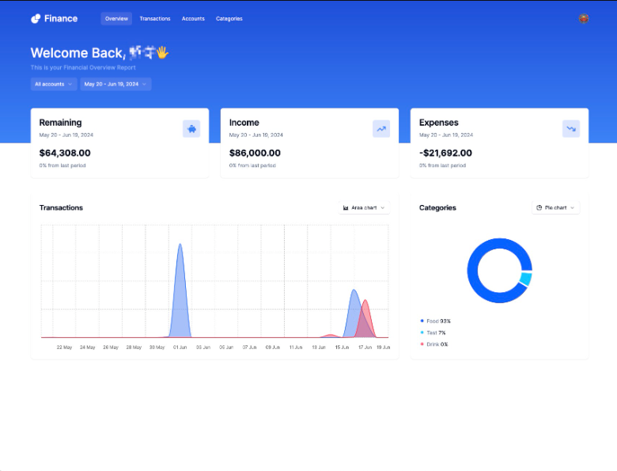
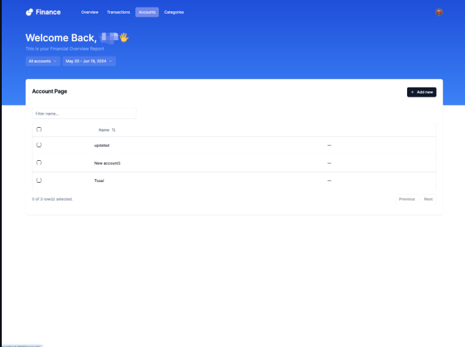
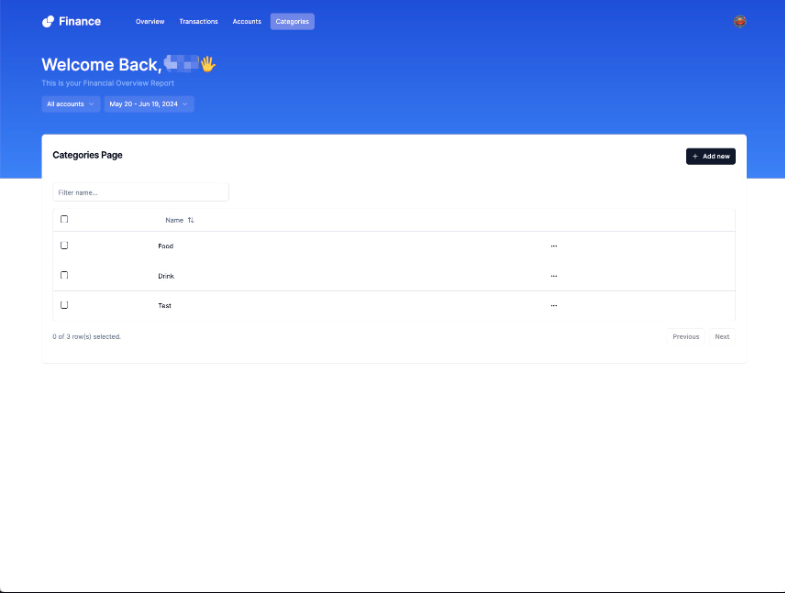
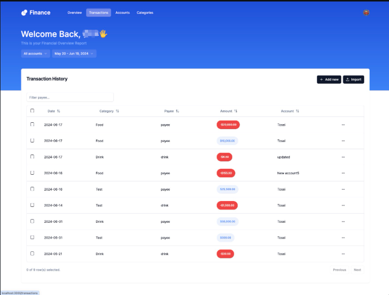

# 1> Introduction

## 💰 Money-Mind: A Personal Finance Dashboard

> A modern financial dashboard web app to manage and analyze transactions, built with Next.js 14 and React 18.

## 📖 About

**Money-Mind** is a full-stack financial dashboard web app built using the latest technologies like **Next.js 14**, **React 18**, **TailwindCSS**, and **Drizzle ORM**. It offers interactive charts, CSV import, authentication via Clerk, and smooth UX with custom React forms.

Ideal for users or businesses who want to **analyze and track financial data**, filter transactions, and view summaries via rich visual dashboards.

## ✨ Main Features

- 🚀 Built with **Next.js 14**
- 🔐 Authentication via **Clerk**
- 🧩 Data validation with **Zod**
- 📈 Interactive dashboard with **changeable chart types**
- 📁 CSV file import support
- 🎛 Filters: **Account** and **Date-based**
- ⚙️ API interfaces with **Hono**
- 🎨 UI powered by **TailwindCSS** & **Shadcn UI**
- 💾 ORM with **Drizzle + NenoDB**
- ☁️ Deployed on **Vercel**

## 🛠 Tech Stack

| Frontend     | Backend     | Styling        | Database       | Hosting  |
|--------------|-------------|----------------|----------------|----------|
| React 18     | Hono API    | TailwindCSS    | NenoDB         | Vercel   |
| Next.js 14   | Clerk Auth  | Shadcn UI      | Drizzle ORM    |          |
| TypeScript   | Zod         |                |                |          |

---

# 2> Install dependencies

npm install
## or
yarn install
## or
pnpm install

---

# 3> Set up environment variables

Create a .env.local file with the following variables:
DATABASE_URL=<your_drizzle_db_url>
CLERK_SECRET_KEY=<your_clerk_secret_key>
NEXT_PUBLIC_CLERK_PUBLISHABLE_KEY=<your_clerk_publishable_key>

---

# 4> Run the development server

npm run dev
## or
yarn dev
## or
pnpm dev
## or
bun dev

---

# 5> Visit

Open http://localhost:3000 in your browser.

---

# 📷 Screenshots

## Dashboard

## Account

## Category

## Transaction

---

# 📄 License
This project is licensed under the MIT License.

Copyright (c) 2025 SNRAI1307

See the full license in the LICENSE file.

